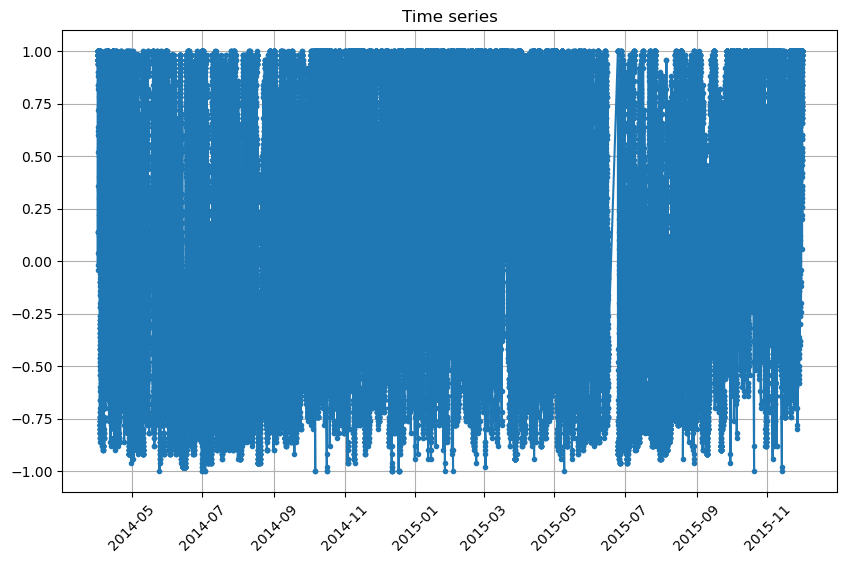
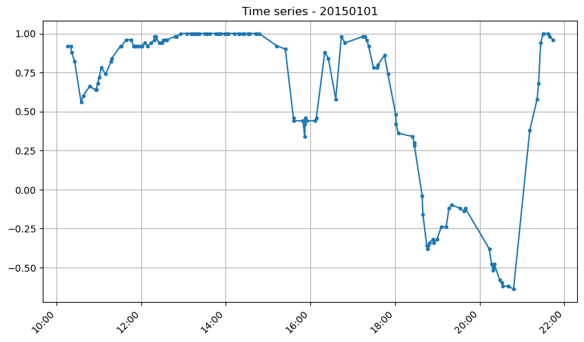
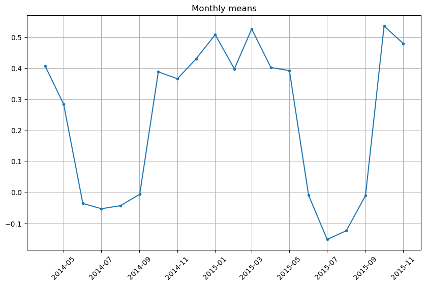
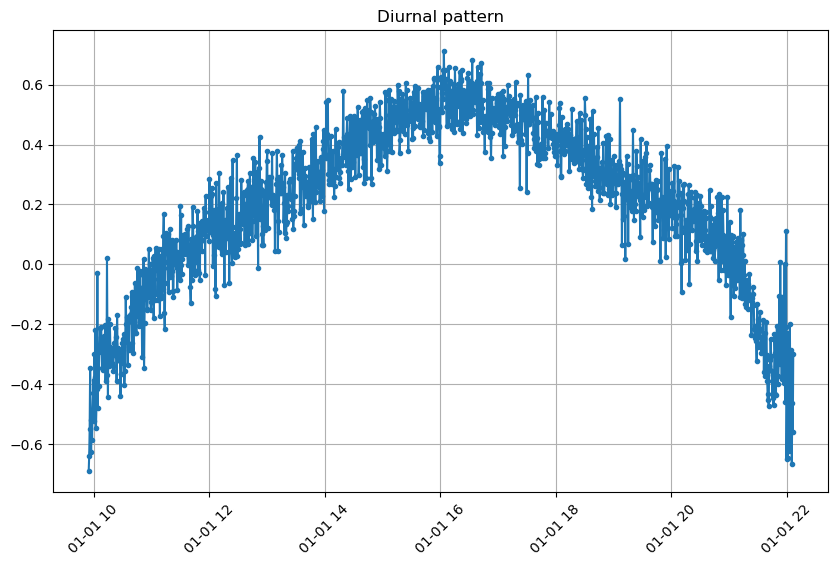

# Médias de séries temporais

Gráficos de uma variável em diferentes condições e intervalos de tempo servem para analisar e compreender comportamentos distintos da variável ao longo do tempo. O objetivo desse código é o de gerar gráficos para explorar a série temporal de uma variável.

## Estrutura

Script principal (main.py) chama o arquivo de métodos (helpers/ts_means.py, que importa as bibliotecas pandas e matplotlib), lê o arquivo de dados (files/ex.csv) e gera os gráficos (files/*.png). Os arquivos gerados (com os métodos aplicados entre parênteses) são os seguintes:

- ts.png (plot_ts): Série temporal sem médias. Esse tipo de gráfico mostra todos os valores individuais da variável ao longo do tempo, sem qualquer forma de agregação ou suavização, permitindo uma visualização de seu comportamento geral.

- ts_day.png (selection+plot_ts): Gráfico de um determinado dia. Focaliza os dados de uma variável ao longo de um único dia, útil para analisar variações intradiárias, picos, vales e padrões específicos.

- ts_month.png (mean_month+plot_ts): Médias mensais. Este gráfico mostra a média da variável para cada mês, agregando os dados diários ou horários em valores mensais. É útil para identificar tendências de longo prazo e padrões sazonais ao longo de vários meses ou anos. Ele ajuda a suavizar flutuações diárias ou semanais, proporcionando uma visão mais clara das variações mensais.

- ts_h.png (mean_h+plot_ts): "time-of-day average plot" (gráfico de média por horário do dia) ou "diurnal pattern plot (gráfico de padrão diurno). Esse tipo de gráfico é utilizado para visualizar padrões temporais médios ao longo de um dia, mostrando como uma variável se comporta em diferentes momentos do dia ao longo de um período de observação. Ele é útil para identificar ciclos diários e variações que ocorrem em horários específicos.

Os dados utilizados como exemplo vieram originalmente da campanha experimental [GoAmazon](https://www.arm.gov/research/campaigns/amf2014goamazon). Referem-se ao somatório dos valores de fração de cobertura de nuvens finas e espessas (cf) obtidos pelo algoritmo de análise de imagens all sky do equipamento TSI. Esses valores foram normalizados de -1 a 1 e selecionados aleatoriamente para uma amostra significativa, porém de menor tamanho.

Obs.: Se todos os dados/timestamps pertencem ao mesmo dia, o método plot_ts altera o rótulo do eixo x para imprimir no formato HH:MM, em vez de YYYY-MM.